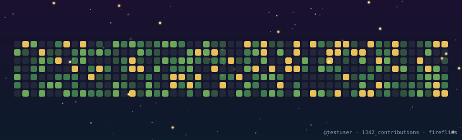

# firefly-contributions

A different take on the "snake eats your contribution graph" genre: instead
of a single deterministic path, a small **swarm of fireflies** flocks over
your GitHub contribution grid at night (boids-style separation / alignment /
cohesion), occasionally peeling off to land on a day you committed, glowing
there for a moment, then scattering back into the swarm.

It's soft and ambient rather than a game — closer to generative art than to
Pac-Man. Everything is pre-simulated and baked into native SVG `<animate>`
keyframes, so it plays right in a GitHub README with **no JavaScript**
(GitHub strips `<script>` from embedded SVGs anyway).

<p align="center">
  
</p>

## How it works

1. **`src/fetchContributions.js`** pulls your contribution calendar, either
   via the authenticated GitHub GraphQL API (recommended — supports private
   contributions) or a public unauthenticated fallback API.
2. **`src/boids.js`** runs a flocking simulation for a fixed number of steps.
   Each firefly is in one of four states: `fly` (normal flocking + wander),
   `seek` (peels off toward a chosen day, weighted toward more-active days),
   `land` (hovers and glows, emitting a "landing event"), `leave` (short
   outward puff before rejoining the flock). All positions are recorded
   frame-by-frame.
3. **`src/renderSvg.js`** turns the baked frames into an SVG: a night-sky
   gradient, a recolored contribution grid, twinkling stars, and the
   fireflies themselves — each one a blurred `<circle>` animated with plain
   SMIL `<animate values="..." keyTimes="...">`, no runtime code involved.
   Cells a firefly lands on get their own synced pulse + halo ring.
4. **`.github/workflows/firefly.yml`** re-runs the generator on a schedule
   and commits the two output SVGs (`firefly-dark.svg` / `firefly-light.svg`)
   to an orphan `output` branch, the same pattern
   [platane/snk](https://github.com/Platane/snk) uses — so your profile
   README can reference a stable raw URL that updates itself daily.

## Quick start

```bash
npm install    # no dependencies to install, this just confirms Node works
node src/generate.js --user <your-github-username>
```

That writes `dist/firefly-dark.svg` and `dist/firefly-light.svg` using the
public (unauthenticated) contributions API. Open either file in a browser to
see it animate.

For production use (private contributions, no rate limits), pass a token:

```bash
node src/generate.js --user <your-github-username> --token <a github PAT with read:user scope>
```

### Setting it up to auto-update on your profile

1. Copy this repo (or fork it) into your `<username>/<username>` profile repo,
   or any repo — it just needs Actions enabled.
2. Push it. The workflow runs daily and on every push to `main`, and can be
   triggered manually from the **Actions** tab.
3. It publishes `firefly-dark.svg` and `firefly-light.svg` to an `output`
   branch. Grab the raw URLs (Actions will create the branch after the first
   run):
   ```
   https://raw.githubusercontent.com/<user>/<repo>/output/firefly-dark.svg
   https://raw.githubusercontent.com/<user>/<repo>/output/firefly-light.svg
   ```
4. Embed it in your profile README with a `<picture>` so it switches with
   the viewer's theme:
   ```html
   <picture>
     <source media="(prefers-color-scheme: dark)" srcset="https://raw.githubusercontent.com/<user>/<repo>/output/firefly-dark.svg" />
     <source media="(prefers-color-scheme: light)" srcset="https://raw.githubusercontent.com/<user>/<repo>/output/firefly-light.svg" />
     /<repo>/output/firefly-dark.svg" alt="my contribution graph, visited by fireflies" />
   </picture>
   ```

If you want private contributions included, create a classic PAT with the
`read:user` scope and add it as a repository secret named `GH_TOKEN` — the
workflow already looks for it.

## Configuration

All flags are optional; CLI flag > nothing (falls back to sane defaults).

| Flag              | Default | Meaning                                                |
| ----------------- | ------- | ------------------------------------------------------- |
| `--user`          | —       | GitHub username to fetch (required)                     |
| `--token`         | —       | GitHub token for the GraphQL API (falls back to public API) |
| `--out`           | `dist`  | Output directory                                        |
| `--particles`     | `14`    | Number of fireflies                                      |
| `--steps`         | `200`   | Simulation frames baked into the animation (more = smoother/longer loop, bigger file) |
| `--stepDuration`  | `0.16`  | Seconds per frame (controls playback speed)              |
| `--tails`         | `true`  | Draw a faint trailing "ghost" dot behind each firefly    |
| `--caption`       | `true`  | Small `@username · N contributions` caption in the corner |
| `--seed`          | derived from username | RNG seed — same seed always produces the same flight paths |

Rough file size: ~150–200 KB per theme at the defaults. Push `--particles`
and `--steps` down if you want a lighter asset; both scale roughly linearly
with file size.

## Design notes

Colors deliberately avoid the stock GitHub green scale and the generic
"black background, neon accent" look: the dark theme is a warm amber swarm
over an indigo-to-teal night sky with a moss/gold grid, and the light theme
is the same swarm over a dusk lavender-to-peach gradient. Landed cells glow
in the same amber as the fireflies, so the "who lit up this day" connection
reads clearly.

The animation loop (default ~32s) isn't perfectly seamless — flight paths
don't return exactly to their start, so there's a small reset at the loop
boundary. Longer `--steps` makes that seam rarer and less noticeable; it's
the one deliberate trade-off for keeping everything dependency-free, SMIL-only
motion instead of shipping a physics engine to the browser.

## Project layout

```
src/
  fetchContributions.js   contribution calendar -> normalized grid cells
  layout.js               grid cells -> pixel coordinates
  boids.js                flocking simulation, baked frame-by-frame
  theme.js                color tokens for dark/light
  renderSvg.js            frames -> final SVG with SMIL animation
  generate.js             CLI glue
.github/workflows/
  firefly.yml             daily regenerate + publish to `output` branch
examples/                 pre-generated sample SVGs (used above in this README)
```

## License

MIT — do whatever you want with it.
